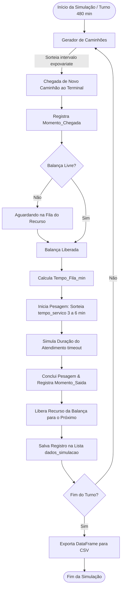

# 🚚 TerminalFlow - Simulador de Logística e Gargalo em Balança Rodoviária


---

## 📌 Visão Geral do Projeto

O **TerminalFlow** é um simulador de eventos discretos (*Discrete Event Simulation - DES*) desenvolvido em Python com a biblioteca **SimPy**. O objetivo do projeto é modelar e analisar o fluxo operacional de entrada e pesagem de caminhões em um terminal logístico / pátio portuário, identificando a formação de filas e gargalos operacionais em recursos críticos compartilhados (como balanças rodoviárias).

### 🎯 Problema Logístico Abordado
Em terminais logísticos, a taxa de chegada de veículos é estocástica (aleatória) e o tempo de pesagem/atendimento também sofre variações. Quando a taxa de chegada se aproxima ou supera a capacidade de atendimento da balança, formam-se filas cumulativas que geram atrasos, custos com estadia (*demurrage*) e congestionamentos nas vias de acesso.

O simulador permite:
- Modelar a chegada aleatória de caminhões via **Distribuição Exponencial** (Processo de Poisson).
- Simular a variação do tempo de atendimento via **Distribuição Uniforme**.
- Gerenciar a fila de espera e o atendimento sequencial (FIFO - *First In, First Out*) em uma balança com capacidade limitada.
- Coletar métricas operacionais individuais por veículo (tempo de fila, tempo de pesagem, momento de entrada e saída).
- Exportar os dados consolidados em formato **CSV** estruturado através do **Pandas** para análise de dados e tomada de decisão gerencial.

---

## 🔄 Fluxo de Funcionamento (Diagrama de Estados)



---

## ⚙️ Pré-requisitos e Instalação

### 1. Clonar ou Acessar o Diretório
```bash
git clone <url-do-repositorio>
cd TerminalFlow_Simulador_Logistica
```

### 2. Criar e Ativar Ambiente Virtual (Recomendado)
- **Windows (PowerShell):**
  ```powershell
  python -m venv .venv
  .venv\Scripts\Activate.ps1
  ```
- **Linux / macOS:**
  ```bash
  python3 -m venv .venv
  source .venv/bin/activate
  ```

### 3. Instalar Dependências
```bash
pip install -r requirements.txt
```
*(Caso prefira instalar diretamente: `pip install simpy pandas`)*

---

## 🚀 Como Executar

Para rodar a simulação de 8 horas de turno (480 minutos simulados), execute:

```bash
python simulador_terminal.py
```

### Saída no Terminal:
```text
Rodando simulação...
Simulação concluída! 109 caminhões processados.
Arquivo 'resultado_gargalo_balanca.csv' gerado com sucesso na sua pasta.
```

---

## 📊 Estrutura do Arquivo de Saída (`resultado_gargalo_balanca.csv`)

O arquivo gerado consolida as métricas de cada veículo que passou pelo terminal:

| Coluna | Tipo | Descrição | Exemplo |
| :--- | :--- | :--- | :--- |
| `Veiculo` | String | Identificador exclusivo do caminhão | `Caminhão 001` |
| `Momento_Chegada` | Float (min) | Instante de chegada no terminal no relógio da simulação | `18.86` |
| `Tempo_Fila_min` | Float (min) | Tempo de espera na fila antes de ser atendido na balança | `3.86` |
| `Tempo_Atendimento_min` | Float (min) | Tempo gasto na pesagem e conferência | `3.80` |
| `Momento_Saida` | Float (min) | Instante em que liberou a balança e saiu do sistema | `26.52` |

---

## 📖 Explicação Linha por Linha do Código (`simulador_terminal.py`)

Abaixo está o detalhamento minucioso de cada uma das 54 linhas do arquivo [`simulador_terminal.py`](simulador_terminal.py):

```python
1: import simpy
```
> **Linha 1:** Importa a biblioteca **SimPy**, que fornece o motor de simulação por eventos discretos (`Environment`), gerenciador de recursos (`Resource`) e mecanismos assíncronos baseados em geradores (`yield`).

```python
2: import random
```
> **Linha 2:** Importa o módulo nativo **random** do Python, utilizado para sortear tempos estocásticos de chegada e duração do atendimento através de distribuições estatísticas.

```python
3: import pandas as pd
```
> **Linha 3:** Importa a biblioteca **Pandas** com o alias convencional `pd`, utilizada para converter a lista de dados coletados em uma estrutura tabular (`DataFrame`) e exportá-la para arquivo CSV.

```python
4: 
```
> **Linha 4:** Linha em branco para separação visual e organização do código.

```python
5: # 1. Lista vazia para funcionar como nosso banco de dados temporário
```
> **Linha 5:** Comentário descritivo indicando a criação do repositório em memória para os dados gerados durante a simulação.

```python
6: dados_simulacao = []
```
> **Linha 6:** Cria uma lista Python vazia chamada `dados_simulacao`. Ela atuará como banco de dados temporário em memória, recebendo um dicionário para cada caminhão que concluir a pesagem.

```python
7: 
```
> **Linha 7:** Linha em branco para organização.

```python
8: def caminhao(env, nome, balanca):
```
> **Linha 8:** Define a função geradora `caminhao`, que representa o ciclo de vida e o comportamento de um veículo individual no terminal. Recebe como parâmetros o ambiente de simulação (`env`), o identificador (`nome`) e o recurso da balança (`balanca`).

```python
9:     hora_chegada = env.now
```
> **Linha 9:** Captura e armazena na variável local `hora_chegada` o momento exato do relógio de simulação (`env.now`) em que este caminhão entra no terminal e entra na disputa pela balança.

```python
10:     
```
> **Linha 10:** Linha em branco para organização.

```python
11:     with balanca.request() as pedido:
```
> **Linha 11:** Utiliza o gerenciador de contexto `with` para criar uma solicitação formal (`pedido`) de uso da balança. O `with` garante que o recurso será liberado automaticamente assim que o bloco for finalizado.

```python
12:         yield pedido
```
> **Linha 12:** Pausa o processo do caminhão e aguarda a concessão do recurso. Se a balança estiver ocupada por outro caminhão, o processo fica retido aqui (formando a fila). Quando a balança é liberada, a execução prossegue.

```python
13:         
```
> **Linha 13:** Linha em branco para organização.

```python
14:         tempo_na_fila = env.now - hora_chegada
```
> **Linha 14:** Calcula o tempo total de espera na fila subtraindo o instante atual de entrada na balança (`env.now`) do momento em que o caminhão chegou (`hora_chegada`).

```python
15:         tempo_servico = random.uniform(3, 6)
```
> **Linha 15:** Sorteia um número de ponto flutuante entre 3 e 6 minutos utilizando a distribuição uniforme contínua, representando a variabilidade no tempo de pesagem e conferência de documentos.

```python
16:         
```
> **Linha 16:** Linha em branco para organização.

```python
17:         yield env.timeout(tempo_servico)
```
> **Linha 17:** Simula a passagem do tempo da pesagem no relógio do SimPy. O processo fica congelado por `tempo_servico` minutos simulados antes de continuar.

```python
18:         hora_saida = env.now
```
> **Linha 18:** Registra o instante exato em que a pesagem terminou e o veículo desocupa a balança.

```python
19:         
```
> **Linha 19:** Linha em branco para organização.

```python
20:         # 2. Em vez de apenas dar print, salvamos os dados em um dicionário
```
> **Linha 20:** Comentário elucidando a estratégia de retenção de métricas para pós-processamento.

```python
21:         dados_simulacao.append({
22:             'Veiculo': nome,
23:             'Momento_Chegada': round(hora_chegada, 2),
24:             'Tempo_Fila_min': round(tempo_na_fila, 2),
25:             'Tempo_Atendimento_min': round(tempo_servico, 2),
26:             'Momento_Saida': round(hora_saida, 2)
27:         })
```
> **Linhas 21 a 27:** Adiciona à lista `dados_simulacao` um dicionário contendo o nome do caminhão e todas as suas métricas arredondadas para 2 casas decimais (`round(..., 2)`).

```python
28: 
```
> **Linha 28:** Linha em branco para separação de funções.

```python
29: def gerador_de_caminhoes(env, balanca, intervalo_medio_chegada):
```
> **Linha 29:** Define a função geradora `gerador_de_caminhoes`, responsável por criar veículos continuamente durante toda a simulação com base em um intervalo médio de chegadas.

```python
30:     i = 0
```
> **Linha 30:** Inicializa o contador sequencial `i` com o valor zero, utilizado para nomear e ordenar os caminhões gerados.

```python
31:     while True:
```
> **Linha 31:** Inicia um laço de repetição contínuo que prosseguirá gerando caminhões enquanto a simulação estiver em execução.

```python
32:         i += 1
```
> **Linha 32:** Incrementa o contador em 1 a cada novo caminhão gerado (1, 2, 3...).

```python
33:         env.process(caminhao(env, f'Caminhão {i:03d}', balanca))
```
> **Linha 33:** Dispara um novo processo independente `caminhao` dentro do ambiente `env`. O identificador é formatado com 3 dígitos (ex: `Caminhão 001`, `Caminhão 002`).

```python
34:         tempo_ate_proximo = random.expovariate(1.0 / intervalo_medio_chegada)
```
> **Linha 34:** Sorteia o tempo de espera até a chegada do próximo caminhão através de uma distribuição exponencial com parâmetro $\lambda = 1 / \text{intervalo\_medio\_chegada}$. Esse modelo estatístico representa chegadas aleatórias independentes (Processo de Poisson).

```python
35:         yield env.timeout(tempo_ate_proximo)
```
> **Linha 35:** Pausa a execução do gerador pelo intervalo sorteado `tempo_ate_proximo`. Apenas após esse tempo transcorrer no ambiente de simulação é que o próximo caminhão será instanciado.

```python
36: 
```
> **Linha 36:** Linha em branco.

```python
37: # ==========================================
38: # 3. Executando e Exportando
39: # ==========================================
```
> **Linhas 37 a 39:** Cabeçalho de comentários indicando o bloco principal de configuração, inicialização e exportação da simulação.

```python
40: print("Rodando simulação...")
```
> **Linha 40:** Exibe no console a mensagem de início do processamento.

```python
41: 
```
> **Linha 41:** Linha em branco.

```python
42: env = simpy.Environment()
```
> **Linha 42:** Cria a instância principal do ambiente SimPy (`Environment`), responsável por manter o relógio interno (`env.now`) e a fila de prioridades dos eventos agendados.

```python
43: balanca = simpy.Resource(env, capacity=1) # Capacidade = 1 balança
```
> **Linha 43:** Cria o recurso compartilhado `balanca` com capacidade igual a 1 (`capacity=1`), o que significa que apenas um caminhão pode ser atendido por vez.

```python
44: env.process(gerador_de_caminhoes(env, balanca, intervalo_medio_chegada=4))
```
> **Linha 44:** Registra e inicializa o processo do `gerador_de_caminhoes` no ambiente, parametrizando a taxa média de chegadas para 1 caminhão a cada 4 minutos.

```python
45: 
```
> **Linha 45:** Linha em branco.

```python
46: # Vamos rodar por mais tempo para gerar mais dados (ex: 8 horas de turno = 480 minutos)
```
> **Linha 46:** Comentário explicativo informando a duração adotada para o turno simulado.

```python
47: env.run(until=480)
```
> **Linha 47:** Inicia a execução contínua do motor do SimPy até que o relógio virtual atinja a marca de 480 minutos (correspondente a 8 horas de operação).

```python
48: 
```
> **Linha 48:** Linha em branco.

```python
49: # 4. Transformando os dados em um DataFrame e exportando para CSV
```
> **Linha 49:** Comentário de seção sobre a persistência dos resultados.

```python
50: df_resultados = pd.DataFrame(dados_simulacao)
```
> **Linha 50:** Converte a lista de dicionários `dados_simulacao` em um `DataFrame` estruturado do Pandas contendo colunas tabuladas.

```python
51: df_resultados.to_csv('resultado_gargalo_balanca.csv', index=False)
```
> **Linha 51:** Grava o DataFrame no disco local no arquivo `resultado_gargalo_balanca.csv`. O parâmetro `index=False` evita que o índice numérico sequencial padrão do Pandas seja gravado como uma coluna extra no CSV.

```python
52: 
```
> **Linha 52:** Linha em branco.

```python
53: print(f"Simulação concluída! {len(df_resultados)} caminhões processados.")
```
> **Linha 53:** Imprime no console a mensagem de sucesso da simulação com a quantidade total de veículos que concluíram a pesagem durante o turno (`len(df_resultados)`).

```python
54: print("Arquivo 'resultado_gargalo_balanca.csv' gerado com sucesso na sua pasta.")
```
> **Linha 54:** Imprime a confirmação de que o arquivo CSV foi criado no diretório de execução.

---

## 🏷️ Dicionário de Variáveis & Exemplificação Prática

Nesta seção, todas as variáveis presentes no projeto são catalogadas com seu **tipo de dado**, **escopo**, **função no sistema** e um **exemplo prático de valor real**.

---

### 1. `dados_simulacao`
- **Tipo:** `list` (Lista de dicionários / `List[dict]`)
- **Escopo:** Global
- **O que é:** Estrutura de dados que atua como histórico acumulativo em memória durante a execução da simulação.
- **Exemplo de Valor:**
  ```python
  [
      {
          'Veiculo': 'Caminhão 001',
          'Momento_Chegada': 0.0,
          'Tempo_Fila_min': 0.0,
          'Tempo_Atendimento_min': 4.67,
          'Momento_Saida': 4.67
      },
      {
          'Veiculo': 'Caminhão 002',
          'Momento_Chegada': 16.79,
          'Tempo_Fila_min': 0.0,
          'Tempo_Atendimento_min': 5.93,
          'Momento_Saida': 22.72
      }
  ]
  ```

---

### 2. `env`
- **Tipo:** `simpy.core.Environment` (Objeto do SimPy)
- **Escopo:** Global e passado como argumento nas funções
- **O que é:** O ambiente central do SimPy que coordena a linha do tempo, a fila de eventos futuros e o relógio virtual da simulação (`env.now`).
- **Exemplo de Valor:** Objeto de simulação com `env.now = 0.0` no início e `env.now = 480.0` no final.

---

### 3. `balanca`
- **Tipo:** `simpy.resources.resource.Resource` (Recurso com Capacidade)
- **Escopo:** Global e passado como argumento
- **O que é:** Representa a infraestrutura física da balança rodoviária do terminal. Possui capacidade unitária (`capacity=1`), atendendo apenas 1 caminhão simultaneamente e colocando os demais em fila (`balanca.queue`).
- **Exemplo de Valor:** Objeto `simpy.Resource(capacity=1, count=1)` quando em uso.

---

### 4. `nome`
- **Tipo:** `str` (String / Texto)
- **Escopo:** Parâmetro local da função `caminhao`
- **O que é:** Identificador único textual atribuído a cada caminhão gerado no sistema.
- **Exemplo de Valor:** `'Caminhão 001'`, `'Caminhão 042'`, `'Caminhão 109'`.

---

### 5. `hora_chegada`
- **Tipo:** `float` (Número Decimal / Ponto Flutuante)
- **Escopo:** Variável local da função `caminhao`
- **O que é:** Armazena o instante (em minutos) do relógio da simulação em que o veículo chega ao terminal e entra na fila da balança.
- **Exemplo de Valor:** `18.86` *(significa que o caminhão chegou aos 18 minutos e 51 segundos de operação)*.

---

### 6. `pedido`
- **Tipo:** `simpy.resources.resource.Request` (Objeto de Requisição)
- **Escopo:** Variável local do bloco `with` na função `caminhao`
- **O que é:** Token/solicitação de acesso ao recurso da balança. Garante a ordem de atendimento e o bloqueio/desbloqueio seguro do recurso.
- **Exemplo de Valor:** `<Request() of Resource(capacity=1)>`.

---

### 7. `tempo_na_fila`
- **Tipo:** `float` (Número Decimal)
- **Escopo:** Variável local da função `caminhao`
- **O que é:** Diferença entre o momento em que a pesagem efetivamente começa e o momento em que o veículo chegou (`env.now - hora_chegada`).
- **Exemplo de Valor:** `3.86` *(caminhão esperou 3,86 minutos na fila antes da balança ser liberada)*.

---

### 8. `tempo_servico`
- **Tipo:** `float` (Número Decimal)
- **Escopo:** Variável local da função `caminhao`
- **O que é:** Duração sorteada aleatoriamente entre 3.0 e 6.0 minutos para a pesagem do caminhão.
- **Exemplo de Valor:** `4.67` *(tempo de atendimento de 4 minutos e 40 segundos)*.

---

### 9. `hora_saida`
- **Tipo:** `float` (Número Decimal)
- **Escopo:** Variável local da função `caminhao`
- **O que é:** Instante do relógio da simulação em que o caminhão termina a pesagem e libera a balança.
- **Exemplo de Valor:** `26.52` *(cálculo: $18.86 + 3.86 + 3.80 = 26.52$ min)*.

---

### 10. `intervalo_medio_chegada`
- **Tipo:** `int` ou `float` (Numérico)
- **Escopo:** Parâmetro da função `gerador_de_caminhoes`
- **O que é:** Média de tempo esperada entre duas chegadas consecutivas de caminhões. É o parâmetro de escala da distribuição exponencial.
- **Exemplo de Valor:** `4` *(em média, chega um caminhão a cada 4 minutos)*.

---

### 11. `i`
- **Tipo:** `int` (Número Inteiro)
- **Escopo:** Variável local da função `gerador_de_caminhoes`
- **O que é:** Contador sequencial que gera os números dos caminhões no formato `f'Caminhão {i:03d}'`.
- **Exemplo de Valor:** `1`, `2`, `3`, ..., `109`.

---

### 12. `tempo_ate_proximo`
- **Tipo:** `float` (Número Decimal)
- **Escopo:** Variável local da função `gerador_de_caminhoes`
- **O que é:** Intervalo de tempo estocástico sorteado pela distribuição exponencial que define quanto tempo o gerador aguarda antes de criar o próximo caminhão.
- **Exemplo de Valor:** `2.15` minutos, `0.45` minutos, `7.82` minutos.

---

### 13. `df_resultados`
- **Tipo:** `pandas.DataFrame` (Tabela de Dados Bidimensional)
- **Escopo:** Global
- **O que é:** Tabela estruturada com linhas (veículos) e colunas (métricas), gerada a partir da lista `dados_simulacao`.
- **Exemplo de Valor:**
  ```text
            Veiculo  Momento_Chegada  Tempo_Fila_min  Tempo_Atendimento_min  Momento_Saida
  0   Caminhão 001             0.00            0.00                   4.67           4.67
  1   Caminhão 002            16.79            0.00                   5.93          22.72
  2   Caminhão 003            18.86            3.86                   3.80          26.52
  ...          ...              ...             ...                    ...            ...
  ```

---

## 📈 Análise de Gargalo Logístico & Extensões

Ao analisar o arquivo CSV de saída, é possível responder perguntas fundamentais de engenharia de processos e logística:
1. **Identificação de Gargalo:** O tempo médio de atendimento (4.5 min) é superior ao intervalo médio de chegada (4.0 min)? Se sim, a fila crescerá indefinidamente ao longo do tempo.
2. **Dimensionamento de Recursos:** O que acontece com a fila se aumentarmos a capacidade para `capacity=2` balanças?
3. **Análise de Nível de Serviço (SLA):** Qual porcentagem dos caminhões esperou mais de 15 minutos na fila?

### 💡 Experimentações Sugeridas
No arquivo [`simulador_terminal.py`](simulador_terminal.py), experimente alterar:
```python
# Cenário A: Adicionar uma 2ª balança no terminal
balanca = simpy.Resource(env, capacity=2)

# Cenário B: Horário de pico (chegada média a cada 2 minutos)
env.process(gerador_de_caminhoes(env, balanca, intervalo_medio_chegada=2))

# Cenário C: Otimização de pesagem automatizada (tempo entre 1.5 e 3 min)
tempo_servico = random.uniform(1.5, 3.0)
```

---

## 👤 Autor

Desenvolvido por **Luan Gomes**  
Projeto focado em Simulação Logística, Pesquisa Operacional e Engenharia de Produção.
