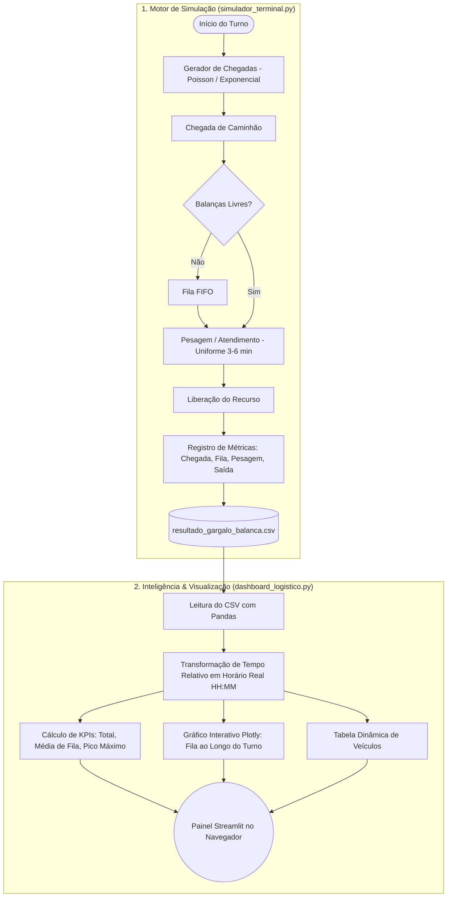

# 🚚 TerminalFlow - Simulador de Logística & Dashboard de Análise de Gargalo


---

## 📌 Visão Geral do Projeto

O **TerminalFlow** é uma solução completa de **Engenharia de Processos e Simulação Logística** que combina:
1. **Motor de Simulação a Eventos Discretos (*DES*)** em Python com **SimPy**: modela a dinâmica de chegada e pesagem de caminhões em um terminal rodoviário/portuário com recursos compartilhados.
2. **Dashboard Web Interativo** em **Streamlit** e **Plotly**: transforma os tempos relativos da simulação em horários reais de turno comercial (ex: 08:00 às 16:00), exibindo KPIs executivos, gráficos dinâmicos de evolução da fila e tabela de dados operacionais.

---

## 🎯 Problema Logístico & Tomada de Decisão

Em operações portuárias, armazéns e centros de distribuição, o dimensionamento de postos de pesagem (balanças rodoviárias) é crítico. Quando a taxa de chegada de carretas oscila e o tempo de pesagem varia:
- **Sobrecarga (Gargalo):** Longas filas na portaria, custos de *demurrage* (estadia) e retenção de motoristas.
- **Ociosidade (Superdimensionamento):** Custos elevados de capital e operação parados.

Com o **TerminalFlow**, você pode testar cenários de capacidade (ex: 1 vs. 2 balanças), simular picos de tráfego e visualizar o impacto direto nos tempos de espera através do dashboard.

---

## 🔄 Fluxo de Arquitetura da Solução



---

## 📁 Estrutura do Repositório

```text
TerminalFlow_Simulador_Logistica/
├── simulador_terminal.py          # Script principal do motor de simulação SimPy
├── dashboard_logistico.py         # Aplicação web interativa com Streamlit e Plotly
├── resultado_gargalo_balanca.csv  # Base de dados gerada pela simulação
├── requirements.txt               # Dependências do projeto
└── README.md                      # Documentação completa
```

---

## ⚙️ Instalação e Configuração

### 1. Clonar o Repositório
```bash
git clone <url-do-repositorio>
cd TerminalFlow_Simulador_Logistica
```

### 2. Criar e Ativar o Ambiente Virtual
- **Windows (PowerShell):**
  ```powershell
  python -m venv .venv
  .venv\Scripts\Activate.ps1
  ```
- **Linux / macOS:**
  ```bash
  python3 -m venv .venv
  source .venv/bin/activate
  ```

### 3. Instalar Dependências
```bash
pip install -r requirements.txt
```

---

## 🚀 Como Executar o Projeto

### Passo 1: Executar a Simulação
Gera a base de dados com o histórico de 8 horas de operação (480 minutos simulados):
```bash
python simulador_terminal.py
```
> **Saída esperada:**
> ```text
> Rodando simulação...
> Simulação concluída! 133 caminhões processados.
> Arquivo 'resultado_gargalo_balanca.csv' gerado com sucesso na sua pasta.
> ```

### Passo 2: Inicializar o Dashboard Interativo
Abra o painel de controle executivo no seu navegador:
```bash
streamlit run dashboard_logistico.py
```
> O Streamlit abrirá automaticamente no endereço: `http://localhost:8501`.

---

## 🖥️ Funcionalidades do Dashboard

- **Métricas em Destaque (Cards):**
  - **Total de Caminhões Atendidos:** Quantidade de veículos que concluíram a pesagem no turno.
  - **Tempo Médio na Fila (min):** Média global de espera dos motoristas.
  - **Fila Máxima Registrada (min):** O pior caso de gargalo enfrentado durante o turno.
- **Gráfico de Barras Cronológico Interativo (Plotly):**
  - Mostra o tempo de espera no eixo Y com base no horário real de chegada (eixo X, ex: `08:15`, `09:30`).
  - Escala de calor (*Color Scale 'Reds'*) destacando visualmente momentos críticos.
  - *Tooltips* ao passar o mouse com nome do veículo e tempo exato de atendimento.
- **Visualizador da Base de Dados Bruta:**
  - Tabela expansível contendo horários formatados, tempos de serviço e saídas.

---

## 📖 Explicação Linha por Linha dos Códigos

---

### 🚚 1. `simulador_terminal.py` (54 Linhas)

```python
1: import simpy
```
> **Linha 1:** Importa o framework **SimPy**, que orquestra o motor de simulação por eventos discretos (`Environment`), recursos com capacidade (`Resource`) e sincronização assíncrona por geradores (`yield`).

```python
2: import random
```
> **Linha 2:** Importa o módulo **random** para gerar números pseudoaleatórios e modelar probabilidades e distribuições estatísticas.

```python
3: import pandas as pd
```
> **Linha 3:** Importa a biblioteca **Pandas** (`pd`), responsável pela estruturação dos dados em tabelas (`DataFrame`) e exportação para CSV.

```python
4: 
```
> **Linha 4:** Linha em branco para separação visual.

```python
5: # 1. Lista vazia para funcionar como nosso banco de dados temporário
```
> **Linha 5:** Comentário descritivo sobre o armazenamento em memória.

```python
6: dados_simulacao = [] 
```
> **Linha 6:** Declara uma lista vazia global que servirá como acumulador de registros (dicionários) de cada veículo atendido.

```python
7: 
```
> **Linha 7:** Linha em branco.

```python
8: def caminhao(env, nome, balanca):
```
> **Linha 8:** Define a função geradora que modela a jornada e ciclo de vida de cada caminhão individual que chega ao terminal.

```python
9:     hora_chegada = env.now
```
> **Linha 9:** Salva na variável local o instante do relógio virtual (`env.now`) em que o veículo chega ao terminal.

```python
10:     
```
> **Linha 10:** Linha em branco.

```python
11:     with balanca.request() as pedido:
```
> **Linha 11:** Requisita formalmente o uso de uma vaga na balança via gerenciador de contexto `with`, garantindo liberação automática ao término do bloco.

```python
12:         yield pedido 
```
> **Linha 12:** Suspende a execução do caminhão caso todas as balanças estejam ocupadas, formando a fila de espera. Quando uma balança desocupa, o SimPy acorda este processo.

```python
13:         
```
> **Linha 13:** Linha em branco.

```python
14:         tempo_na_fila = env.now - hora_chegada
```
> **Linha 14:** Calcula o tempo real que o veículo passou aguardando na fila (`momento que entrou na balança - momento da chegada`).

```python
15:         tempo_servico = random.uniform(3, 6)
```
> **Linha 15:** Sorteia a duração do atendimento de pesagem através de uma distribuição uniforme contínua entre 3.0 e 6.0 minutos.

```python
16:         
```
> **Linha 16:** Linha em branco.

```python
17:         yield env.timeout(tempo_servico) 
```
> **Linha 17:** Faz o relógio da simulação avançar pelo período de `tempo_servico`, simulando a duração física da pesagem.

```python
18:         hora_saida = env.now
```
> **Linha 18:** Registra o momento em que a pesagem foi concluída e a balança será desocupada.

```python
19:         
```
> **Linha 19:** Linha em branco.

```python
20:         # 2. Em vez de apenas dar print, salvamos os dados em um dicionário
```
> **Linha 20:** Comentário explicativo sobre a persistência dos dados.

```python
21:         dados_simulacao.append({
22:             'Veiculo': nome,
23:             'Momento_Chegada': round(hora_chegada, 2),
24:             'Tempo_Fila_min': round(tempo_na_fila, 2),
25:             'Tempo_Atendimento_min': round(tempo_servico, 2),
26:             'Momento_Saida': round(hora_saida, 2)
27:         })
```
> **Linhas 21 a 27:** Adiciona o registro individual com métricas arredondadas em 2 casas decimais à lista `dados_simulacao`.

```python
28: 
```
> **Linha 28:** Linha em branco.

```python
29: def gerador_de_caminhoes(env, balanca, intervalo_medio_chegada):
```
> **Linha 29:** Define a função geradora que cria os caminhões em fluxo contínuo segundo a distribuição de chegadas.

```python
30:     i = 0
```
> **Linha 30:** Inicializa o contador de identificação dos veículos em zero.

```python
31:     while True:
```
> **Linha 31:** Cria um laço de repetição contínuo que roda enquanto a simulação estiver ativa.

```python
32:         i += 1
```
> **Linha 32:** Incrementa o sequencial do veículo (1, 2, 3...).

```python
33:         env.process(caminhao(env, f'Caminhão {i:03d}', balanca))
```
> **Linha 33:** Dispara um novo processo independente para o caminhão recém-criado, formatando o nome com três dígitos (ex: `Caminhão 001`).

```python
34:         tempo_ate_proximo = random.expovariate(1.0 / intervalo_medio_chegada)
```
> **Linha 34:** Sorteia o tempo de espera até a chegada do próximo veículo usando distribuição exponencial com taxa $\lambda = 1 / 4.0$ (Processo de Poisson).

```python
35:         yield env.timeout(tempo_ate_proximo)
```
> **Linha 35:** Aguarda o tempo sorteado transcorrer no relógio da simulação antes de iterar e gerar o próximo veículo.

```python
36: 
```
> **Linha 36:** Linha em branco.

```python
37: # ==========================================
38: # 3. Executando e Exportando
39: # ==========================================
```
> **Linhas 37 a 39:** Cabeçalho visual demarcando a seção principal de execução.

```python
40: print("Rodando simulação...")
```
> **Linha 40:** Emite mensagem informativa no terminal avisando o início da execução.

```python
41: 
```
> **Linha 41:** Linha em branco.

```python
42: env = simpy.Environment()
```
> **Linha 42:** Cria a instância principal do ambiente SimPy.

```python
43: balanca = simpy.Resource(env, capacity=2) # Capacidade = 2 balanças
```
> **Linha 43:** Cria o recurso compartilhado `balanca` com capacidade de atendimento simultâneo para 2 caminhões (`capacity=2`).

```python
44: env.process(gerador_de_caminhoes(env, balanca, intervalo_medio_chegada=4))
```
> **Linha 44:** Inicia o gerador de caminhões no ambiente, configurando o tempo médio entre chegadas para 4 minutos.

```python
45: 
```
> **Linha 45:** Linha em branco.

```python
46: # Vamos rodar por mais tempo para gerar mais dados (ex: 8 horas de turno = 480 minutos)
```
> **Linha 46:** Comentário sobre o horizonte temporal de simulação.

```python
47: env.run(until=480) 
```
> **Linha 47:** Executa o motor da simulação até o relógio atingir 480 minutos virtuais (8 horas).

```python
48: 
```
> **Linha 48:** Linha em branco.

```python
49: # 4. Transformando os dados em um DataFrame e exportando para CSV
```
> **Linha 49:** Comentário da etapa de exportação.

```python
50: df_resultados = pd.DataFrame(dados_simulacao)
```
> **Linha 50:** Converte a lista `dados_simulacao` em um DataFrame tabular do Pandas.

```python
51: df_resultados.to_csv('resultado_gargalo_balanca.csv', index=False)
```
> **Linha 51:** Salva os resultados no arquivo `resultado_gargalo_balanca.csv` sem incluir a coluna de índice do Pandas.

```python
52: 
```
> **Linha 52:** Linha em branco.

```python
53: print(f"Simulação concluída! {len(df_resultados)} caminhões processados.")
```
> **Linha 53:** Exibe no terminal a quantidade total de caminhões atendidos durante o turno.

```python
54: print("Arquivo 'resultado_gargalo_balanca.csv' gerado com sucesso na sua pasta.")
```
> **Linha 54:** Confirma a gravação com sucesso do arquivo CSV.

---

### 📊 2. `dashboard_logistico.py` (63 Linhas)

```python
1: import streamlit as st
```
> **Linha 1:** Importa o framework **Streamlit** (`st`) para criação da interface web interativa e dos componentes visuais.

```python
2: import pandas as pd
```
> **Linha 2:** Importa a biblioteca **Pandas** (`pd`) para carregar o CSV, manipular séries temporais e calcular métricas estatísticas.

```python
3: import plotly.express as px
```
> **Linha 3:** Importa o módulo de alto nível **Plotly Express** (`px`) para geração de gráficos dinâmicos, responsivos e interativos.

```python
4: 
```
> **Linha 4:** Linha em branco.

```python
5: st.set_page_config(page_title="Dashboard de Simulação Logística", layout="wide")
```
> **Linha 5:** Configura a página web do Streamlit: define o título da aba do navegador e adota o layout em largura total (`wide`) para melhor distribuição dos gráficos.

```python
6: st.title("🚛 Dashboard: Análise de Gargalos no Terminal")
```
> **Linha 6:** Renderiza o título principal no topo da página.

```python
7: st.markdown("Visualização dos dados gerados pelo modelo de simulação no SimPy.")
```
> **Linha 7:** Adiciona uma descrição em texto markdown contextualizando a aplicação.

```python
8: 
```
> **Linha 8:** Linha em branco.

```python
9: try:
```
> **Linha 9:** Inicia um bloco de tratamento de exceções `try/except` para garantir que o dashboard lide graciosamente com a ausência do arquivo CSV.

```python
10:     df = pd.read_csv('resultado_gargalo_balanca.csv')
```
> **Linha 10:** Lê o arquivo CSV gerado pelo simulador e o carrega em um DataFrame `df`.

```python
11:     
12:     # ==========================================
13:     # A MÁGICA DA TRANSFORMAÇÃO DE DADOS AQUI
14:     # ==========================================
```
> **Linhas 11 a 14:** Separador de seção sobre a conversão de tempo relativo para tempo absoluto.

```python
15:     # 1. Definimos a hora que o turno começa (ex: 08:00 da manhã de hoje)
16:     hora_inicio_turno = pd.to_datetime('08:00:00')
```
> **Linha 16:** Cria um objeto `Timestamp` representando o início das operações do terminal às `08:00:00`.

```python
17:     
18:     # 2. Somamos os minutos corridos da simulação a essa hora de início
19:     df['Hora_Exata_Chegada'] = hora_inicio_turno + pd.to_timedelta(df['Momento_Chegada'], unit='m')
20:     df['Hora_Exata_Saida'] = hora_inicio_turno + pd.to_timedelta(df['Momento_Saida'], unit='m')
```
> **Linhas 19 e 20:** Converte os minutos corridos da simulação (`unit='m'`) em intervalos de tempo (`Timedelta`) e os soma ao horário base de início (`08:00`), gerando as colunas de data/hora absolutas de chegada e saída de cada veículo.

```python
21:     
22:     # 3. Formatamos para ficar bonito de ler (Apenas Hora:Minuto)
23:     df['Chegada_Formatada'] = df['Hora_Exata_Chegada'].dt.strftime('%H:%M')
24:     df['Saida_Formatada'] = df['Hora_Exata_Saida'].dt.strftime('%H:%M')
```
> **Linhas 23 e 24:** Formata as datas/horas em strings no padrão legível `HH:MM` (ex: `08:35`, `14:12`) para uso amigável nos eixos dos gráficos e tabelas.

```python
25:     
26:     # ==========================================
27: 
28:     col1, col2, col3 = st.columns(3)
```
> **Linha 28:** Divide o layout da página em 3 colunas horizontais para exibir os cards de indicadores operacionais (*KPIs*).

```python
29:     
30:     total_veiculos = len(df)
31:     tempo_medio_fila = df['Tempo_Fila_min'].mean()
32:     tempo_maximo_fila = df['Tempo_Fila_min'].max()
```
> **Linhas 30 a 32:** Calcula as principais métricas agregadas da simulação: total de veículos processados, tempo médio de espera e tempo máximo de espera registrado.

```python
33:     
34:     col1.metric("Total de Caminhões Atendidos", total_veiculos)
35:     col2.metric("Tempo Médio na Fila (min)", f"{tempo_medio_fila:.1f}")
36:     col3.metric("Fila Máxima Registrada (min)", f"{tempo_maximo_fila:.1f}")
```
> **Linhas 34 a 36:** Renderiza os cards visuais de métricas em cada uma das 3 colunas configuradas.

```python
37:     
38:     st.divider() 
```
> **Linha 38:** Insere uma linha divisória visual horizontal na página.

```python
39:     
40:     st.subheader("Evolução da Fila ao Longo do Tempo")
```
> **Linha 40:** Adiciona o subtítulo da seção do gráfico temporal.

```python
41:     
42:     # Atualizamos o gráfico para usar a nossa nova coluna formatada no eixo X
43:     fig = px.bar(
44:         df, 
45:         x='Chegada_Formatada', # Agora o eixo X mostra horários como 08:15, 09:30
46:         y='Tempo_Fila_min',
47:         hover_data=['Veiculo', 'Tempo_Atendimento_min'],
48:         labels={'Chegada_Formatada': 'Horário de Chegada', 'Tempo_Fila_min': 'Tempo de Espera na Fila (min)'},
49:         color='Tempo_Fila_min',
50:         color_continuous_scale='Reds' 
51:     )
```
> **Linhas 43 a 51:** Constrói o gráfico de barras interativo com **Plotly Express**, mapeando o horário no eixo X, o tempo de fila no eixo Y, dados adicionais no tooltip ao passar o mouse (`hover_data`) e gradiente de cores térmico (`Reds`).

```python
52:     
53:     # Ajuste para as barras não ficarem espremidas e manter a ordem cronológica
54:     fig.update_xaxes(type='category', tickmode='linear', dtick=10) 
```
> **Linha 54:** Ajusta a formatação do eixo X para exibir os rótulos de forma espaçada a cada 10 registros (`dtick=10`), prevenindo poluição visual.

```python
55:     
56:     st.plotly_chart(fig, use_container_width=True)
```
> **Linha 56:** Renderiza o gráfico do Plotly no Streamlit ocupando a largura total do container.

```python
57:     
58:     with st.expander("Ver Base de Dados Bruta"):
59:         # Mostramos as colunas novas que são mais fáceis de ler
60:         st.dataframe(df[['Veiculo', 'Chegada_Formatada', 'Tempo_Fila_min', 'Tempo_Atendimento_min', 'Saida_Formatada']])
```
> **Linhas 58 a 60:** Cria um componente expansível (`expander`) contendo a tabela de dados formatada para inspeção detalhada de cada caminhão.

```python
61: 
62: except FileNotFoundError:
63:     st.error("O arquivo 'resultado_gargalo_balanca.csv' não foi encontrado. Rode o seu script de simulação primeiro!")
```
> **Linhas 62 e 63:** Captura o erro caso o CSV ainda não tenha sido gerado e exibe um alerta vermelho amigável instruindo a rodar a simulação primeiro.

---

## 🏷️ Dicionário & Guia Completo de Variáveis com Exemplificação

---

### 📦 A. Variáveis do Simulador (`simulador_terminal.py`)

| Variável | Tipo | Escopo | Descrição & Papel no Sistema | Exemplo Real |
| :--- | :--- | :--- | :--- | :--- |
| `dados_simulacao` | `list` (`List[dict]`) | Global | Lista acumuladora em memória que guarda o histórico de cada veículo atendido. | `[{'Veiculo': 'Caminhão 001', 'Momento_Chegada': 0.0, 'Tempo_Fila_min': 0.0, 'Tempo_Atendimento_min': 4.67, 'Momento_Saida': 4.67}, ...]` |
| `env` | `simpy.Environment` | Global / Parâmetro | O motor do SimPy que coordena o relógio virtual (`env.now`) e a lista de eventos futuros. | `<Environment() at 0x...>` com `env.now = 480.0` no encerramento |
| `balanca` | `simpy.Resource` | Global / Parâmetro | O recurso físico com capacidade limitada (`capacity=2`) disputado pelos caminhões. | `<Resource(capacity=2, count=1)>` |
| `nome` | `str` | Local (`caminhao`) | Identificador textual atribuído sequencialmente a cada caminhão. | `'Caminhão 001'`, `'Caminhão 042'` |
| `hora_chegada` | `float` | Local (`caminhao`) | Instante em minutos da simulação no qual o veículo adentrou a fila do terminal. | `18.86` (18 min e 51 seg de turno) |
| `pedido` | `simpy.Request` | Local (`caminhao`) | Token de requisição ao recurso da balança usado dentro do bloco `with`. | `<Request() of Resource(capacity=2)>` |
| `tempo_na_fila` | `float` | Local (`caminhao`) | Tempo decorrido entre a chegada do veículo e o início efetivo da pesagem (`env.now - hora_chegada`). | `2.45` minutos |
| `tempo_servico` | `float` | Local (`caminhao`) | Duração sorteada aleatoriamente (uniforme 3 a 6 min) para pesagem e conferência. | `4.67` minutos |
| `hora_saida` | `float` | Local (`caminhao`) | Instante em que o caminhão desocupou a balança e saiu do terminal. | `26.52` minutos |
| `intervalo_medio_chegada` | `int` ou `float` | Parâmetro (`gerador`) | Média de tempo esperada entre a chegada de dois caminhões consecutivos ($\lambda = 1/4$). | `4` minutos |
| `i` | `int` | Local (`gerador`) | Contador numérico sequencial para indexação dos veículos criados. | `1, 2, 3, ..., 133` |
| `tempo_ate_proximo` | `float` | Local (`gerador`) | Intervalo sorteado pela distribuição exponencial até o próximo veículo chegar. | `3.18` minutos |
| `df_resultados` | `pd.DataFrame` | Global | Tabela estruturada final criada para exportação em formato `.csv`. | DataFrame com 133 linhas e 5 colunas |

---

### 📊 B. Variáveis do Dashboard (`dashboard_logistico.py`)

| Variável | Tipo | Escopo | Descrição & Papel no Sistema | Exemplo Real |
| :--- | :--- | :--- | :--- | :--- |
| `df` | `pd.DataFrame` | Global | Conjunto de dados tabulado carregado a partir de `resultado_gargalo_balanca.csv`. | Tabela com colunas originais e colunas calculadas de horário |
| `hora_inicio_turno` | `pd.Timestamp` | Global | Horário base de abertura do turno operacional para conversão em horas reais. | `Timestamp('2026-08-29 08:00:00')` |
| `df['Hora_Exata_Chegada']` | `pd.Series` (`datetime64`) | Coluna do DataFrame | Data/hora absoluta da chegada resultante da soma de `08:00` + minutos de simulação. | `Timestamp('2026-08-29 08:18:51')` |
| `df['Hora_Exata_Saida']` | `pd.Series` (`datetime64`) | Coluna do DataFrame | Data/hora absoluta da saída do terminal. | `Timestamp('2026-08-29 08:26:31')` |
| `df['Chegada_Formatada']` | `pd.Series` (`object` / `str`) | Coluna do DataFrame | Horário de chegada formatado em string amigável `HH:MM`. | `'08:18'`, `'09:45'`, `'15:20'` |
| `df['Saida_Formatada']` | `pd.Series` (`object` / `str`) | Coluna do DataFrame | Horário de liberação da balança formatado em string `HH:MM`. | `'08:26'`, `'09:51'`, `'15:27'` |
| `col1, col2, col3` | `streamlit.delta_generator` | Global | Referências para as 3 colunas de layout criadas por `st.columns(3)`. | Contêineres visuais do Streamlit |
| `total_veiculos` | `int` | Global | Contagem total de caminhões processados durante a simulação (`len(df)`). | `133` |
| `tempo_medio_fila` | `float` | Global | Média aritmética do tempo de espera na fila de todos os caminhões (`mean()`). | `1.8` minutos |
| `tempo_maximo_fila` | `float` | Global | Maior tempo individual de espera registrado na fila (`max()`). | `8.6` minutos |
| `fig` | `plotly.graph_objs.Figure` | Global | Objeto de figura gráfica do Plotly contendo o gráfico de barras interativo. | Objeto de gráfico com eixos, cores e tooltips |

---

## 📈 Estudo de Caso: Comparativo de Capacidade (1 vs. 2 Balanças)

Ao simular 8 horas de operação com chegada média a cada 4 minutos e pesagem entre 3 e 6 minutos (média de 4.5 minutos):

| Cenário | Capacidade da Balança | Caminhões Atendidos | Tempo Médio de Fila | Fila Máxima | Comportamento do Sistema |
| :--- | :---: | :---: | :---: | :---: | :--- |
| **Cenário A** | `capacity=1` | ~109 | ~12.5 min | ~21.4 min | **Gargalo Crítico:** A demanda média (1 a cada 4 min) supera a capacidade média de 1 balança (1 a cada 4.5 min), gerando fila crescente. |
| **Cenário B** | `capacity=2` | ~133 | ~1.5 min | ~6.8 min | **Fluxo Otimizado:** Com 2 postos de pesagem, a capacidade máxima dobra para 1 caminhão a cada 2.25 min, absorvendo picos com folga. |

---

## 👤 Autor

Desenvolvido por **Luan Gomes**  
Projeto voltado a Simulação Logística, Pesquisa Operacional e Ciência de Dados Aplicada à Cadeia de Suprimentos.
