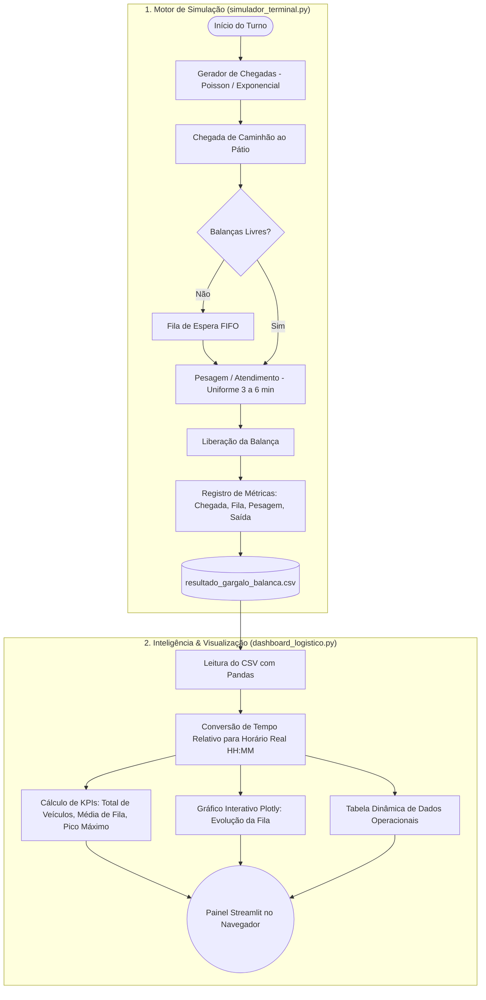

# 🚚 TerminalFlow - Simulador de Logística & Dashboard de Análise de Gargalo


---

## 📌 Visão Geral do Projeto

O **TerminalFlow** é uma solução de **Simulação a Eventos Discretos (*Discrete Event Simulation - DES*)** e **Business Intelligence (BI)** voltada para Engenharia de Produção e Logística. 

O projeto simula a chegada e a pesagem de caminhões em um terminal rodoviário/portuário, mensura a formação de filas em recursos compartilhados (balanças rodoviárias) e apresenta um **Dashboard Executivo Interativo** em tempo real.

### 🎯 Problema Logístico Abordado
Em pátios logísticos, a taxa de chegada de caminhões é estocástica (aleatória) e o tempo de pesagem varia conforme a carga e a conferência. Quando o fluxo de chegada se aproxima ou ultrapassa a capacidade de atendimento das balanças, formam-se filas cumulativas que geram atrasos, custos com estadia (*demurrage*) e congestionamentos.

O simulador permite avaliar:
- O impacto do número de balanças ativas (`capacity`).
- O comportamento da fila sob diferentes taxas médias de chegada ($\lambda$).
- Identificação visual dos momentos de pico operacional ao longo de um turno de trabalho.

---

## 🔄 Fluxo de Arquitetura da Solução



---

## 📁 Estrutura do Repositório

```text
TerminalFlow_Simulador_Logistica/
├── screenshot/                    # Pasta contendo as imagens e capturas de tela do dashboard
│   └── dashboard.png              # Demonstração visual da interface em Streamlit
├── simulador_terminal.py          # Script com o motor de simulação SimPy
├── dashboard_logistico.py         # Aplicação web com dashboard em Streamlit e Plotly
├── resultado_gargalo_balanca.csv  # Base de dados gerada pela simulação
├── requirements.txt               # Dependências do projeto
└── README.md                      # Documentação do projeto
```

---

## ⚙️ Instalação e Configuração

### 1. Clonar o Repositório
```bash
git clone <url-do-repositorio>
cd TerminalFlow_Simulador_Logistica
```

### 2. Criar e Ativar o Ambiente Virtual
- **Windows (PowerShell):**
  ```powershell
  python -m venv .venv
  .venv\Scripts\Activate.ps1
  ```
- **Linux / macOS:**
  ```bash
  python3 -m venv .venv
  source .venv/bin/activate
  ```

### 3. Instalar Dependências
```bash
pip install -r requirements.txt
```

---

## 🚀 Como Executar o Projeto

### Passo 1: Executar a Simulação
Rode o script que simula um turno de 8 horas (480 minutos) e gera a base de dados:
```bash
python simulador_terminal.py
```
> **Saída esperada:**
> ```text
> Rodando simulação...
> Simulação concluída! 133 caminhões processados.
> Arquivo 'resultado_gargalo_balanca.csv' gerado com sucesso na sua pasta.
> ```

### Passo 2: Inicializar o Dashboard Interativo
Abra a interface visual executiva no navegador:
```bash
streamlit run dashboard_logistico.py
```
> A aplicação será iniciada localmente em: `http://localhost:8501`.

---

## 📊 Estrutura dos Dados Gerados (`resultado_gargalo_balanca.csv`)

| Coluna | Tipo | Descrição | Exemplo |
| :--- | :--- | :--- | :--- |
| `Veiculo` | String | Identificador do caminhão | `Caminhão 001` |
| `Momento_Chegada` | Float (min) | Instante de chegada no relógio da simulação | `18.86` |
| `Tempo_Fila_min` | Float (min) | Tempo de espera na fila até iniciar a pesagem | `3.86` |
| `Tempo_Atendimento_min` | Float (min) | Duração da pesagem e conferência | `3.80` |
| `Momento_Saida` | Float (min) | Instante de conclusão e liberação da balança | `26.52` |

---

## 🏷️ Dicionário de Variáveis & Exemplificação Prática

Nesta seção estão detalhadas todas as variáveis utilizadas no simulador e no dashboard, indicando seu tipo de dado, escopo, função no sistema e exemplos práticos.

---

### 📦 1. Variáveis do Motor de Simulação (`simulador_terminal.py`)

| Variável | Tipo | Escopo | Descrição & Papel no Sistema | Exemplo Real |
| :--- | :--- | :--- | :--- | :--- |
| `dados_simulacao` | `list` (`List[dict]`) | Global | Lista acumuladora em memória que guarda o histórico de cada veículo atendido. | `[{'Veiculo': 'Caminhão 001', 'Momento_Chegada': 0.0, 'Tempo_Fila_min': 0.0, 'Tempo_Atendimento_min': 4.67, 'Momento_Saida': 4.67}, ...]` |
| `env` | `simpy.Environment` | Global / Parâmetro | O motor do SimPy que coordena o relógio virtual (`env.now`) e a lista de eventos futuros. | `<Environment()>` com `env.now = 480.0` no encerramento |
| `balanca` | `simpy.Resource` | Global / Parâmetro | O recurso físico com capacidade limitada (`capacity=2`) disputado pelos caminhões. | `<Resource(capacity=2, count=1)>` |
| `nome` | `str` | Local (`caminhao`) | Identificador textual atribuído sequencialmente a cada caminhão. | `'Caminhão 001'`, `'Caminhão 042'` |
| `hora_chegada` | `float` | Local (`caminhao`) | Instante em minutos da simulação no qual o veículo adentrou a fila do terminal. | `18.86` *(18 min e 51 seg de turno)* |
| `pedido` | `simpy.Request` | Local (`caminhao`) | Token de requisição ao recurso da balança usado no bloco `with balanca.request()`. | `<Request() of Resource(capacity=2)>` |
| `tempo_na_fila` | `float` | Local (`caminhao`) | Tempo decorrido entre a chegada do veículo e o início efetivo da pesagem (`env.now - hora_chegada`). | `2.45` minutos |
| `tempo_servico` | `float` | Local (`caminhao`) | Duração sorteada aleatoriamente (distribuição uniforme 3 a 6 min) para a pesagem. | `4.67` minutos |
| `hora_saida` | `float` | Local (`caminhao`) | Instante em que o caminhão desocupou a balança e liberou o recurso. | `26.52` minutos |
| `intervalo_medio_chegada` | `int` ou `float` | Parâmetro (`gerador`) | Média de tempo esperada entre duas chegadas consecutivas de caminhões ($\lambda = 1/4$). | `4` minutos |
| `i` | `int` | Local (`gerador`) | Contador numérico sequencial para indexação dos veículos criados. | `1, 2, 3, ..., 133` |
| `tempo_ate_proximo` | `float` | Local (`gerador`) | Intervalo sorteado pela distribuição exponencial até o próximo veículo chegar. | `3.18` minutos |
| `df_resultados` | `pd.DataFrame` | Global | Tabela estruturada final criada para exportação em formato `.csv`. | DataFrame com 133 linhas e 5 colunas |

---

### 📊 2. Variáveis do Dashboard (`dashboard_logistico.py`)

| Variável | Tipo | Escopo | Descrição & Papel no Sistema | Exemplo Real |
| :--- | :--- | :--- | :--- | :--- |
| `df` | `pd.DataFrame` | Global | Conjunto de dados carregado a partir de `resultado_gargalo_balanca.csv`. | Tabela com colunas originais e colunas calculadas de horário |
| `hora_inicio_turno` | `pd.Timestamp` | Global | Horário base de abertura do turno operacional para conversão em horas reais. | `Timestamp('2026-08-29 08:00:00')` |
| `df['Hora_Exata_Chegada']` | `pd.Series` (`datetime64`) | Coluna do DataFrame | Data/hora absoluta de chegada (`08:00` + minutos de simulação). | `Timestamp('2026-08-29 08:18:51')` |
| `df['Hora_Exata_Saida']` | `pd.Series` (`datetime64`) | Coluna do DataFrame | Data/hora absoluta de liberação da balança. | `Timestamp('2026-08-29 08:26:31')` |
| `df['Chegada_Formatada']` | `pd.Series` (`str`) | Coluna do DataFrame | Horário de chegada formatado em texto legível `HH:MM`. | `'08:18'`, `'09:45'`, `'15:20'` |
| `df['Saida_Formatada']` | `pd.Series` (`str`) | Coluna do DataFrame | Horário de saída formatado em texto legível `HH:MM`. | `'08:26'`, `'09:51'`, `'15:27'` |
| `col1, col2, col3` | `st.delta_generator` | Global | Contêineres de layout em colunas para os cards de métricas. | Contêineres visuais do Streamlit |
| `total_veiculos` | `int` | Global | Quantidade total de caminhões atendidos durante o turno (`len(df)`). | `133` |
| `tempo_medio_fila` | `float` | Global | Média aritmética do tempo de espera na fila de todos os caminhões (`mean()`). | `1.8` minutos |
| `tempo_maximo_fila` | `float` | Global | Maior tempo de espera registrado na fila durante todo o turno (`max()`). | `8.6` minutos |
| `fig` | `plotly.graph_objs.Figure` | Global | Gráfico de barras interativo construído com o Plotly Express. | Objeto de figura do Plotly |

---

## 📈 Estudo de Caso: Comparativo de Capacidade (1 vs. 2 Balanças)

Resultados típicos obtidos com uma jornada de 8 horas de operação (média de chegada = 4 min; atendimento = 3 a 6 min):

| Cenário | Capacidade da Balança | Caminhões Atendidos | Tempo Médio de Fila | Fila Máxima | Comportamento Operacional |
| :--- | :---: | :---: | :---: | :---: | :--- |
| **Cenário A** | `capacity=1` | ~109 | ~12.5 min | ~21.4 min | **Gargalo Crítico:** A taxa de chegada supera o ritmo de atendimento de 1 balança, gerando fila cumulativa. |
| **Cenário B** | `capacity=2` | ~133 | ~1.5 min | ~6.8 min | **Fluxo Otimizado:** Com 2 balanças, a capacidade do sistema dobra, absorvendo picos sem acúmulo de fila. |

---

## 👤 Autor

Desenvolvido por **Luan Gomes**  
Projeto voltado a Simulação Logística, Pesquisa Operacional e Ciência de Dados Aplicada à Cadeia de Suprimentos.
